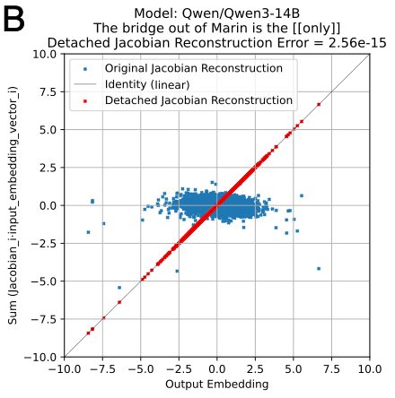
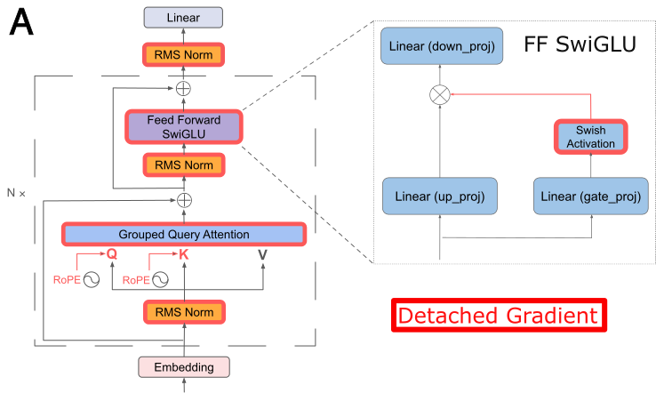

# Understanding Large Language Models Through Linear Mappings

*An accessible introduction to interpreting how LLMs make predictions*

---

[Paper published in Transactions on Machine Learning Research, 10/2025](https://openreview.net/forum?id=oDWbJsIuEp) [Arxiv](https://arxiv.org/abs/2505.24293)

## What Are We Trying to Understand?

Large Language Models (LLMs) like GPT, Claude, and Llama have become incredibly powerful, but understanding *how* they work remains a fundamental challenge. These models are complex, with billions of parameters organized into many layers of transformers. When you give them a prompt like "The bridge out of Marin is the", they predict the next word (maybe "Golden"). But what's actually happening inside?

This blog post explores a recent research paper that offers a fascinating new way to peer inside these models: by expressing their computations as equivalent linear systems that we can analyze and interpret.

## The Core Idea: Making Nonlinear Models Linear (Sort Of)

Here's the key insight: even though LLMs are globally nonlinear functions (meaning their behavior is complex and curved), for any specific input, we can find an equivalent linear representation that reconstructs the model's output with extremely high precision.

Think of it like this: imagine you're trying to understand a complicated curved surface. While the whole surface is curved, if you zoom into one specific point, you can approximate it locally with a flat plane (this is what derivatives do in calculus). This research does something similar but more powerful—it finds an exact linear representation at each operating point.

### Why Does This Matter?

Linear systems are much easier to understand and analyze than nonlinear ones. Once we have a linear representation, we can use tools like:
- **Singular Value Decomposition (SVD)** to understand which directions in the input space matter most
- **Matrix analysis** to see how input tokens influence the output
- **Dimensionality analysis** to measure how many "degrees of freedom" the model is really using

## The Technical Trick: The Detached Jacobian

### Quick Math Background

The Jacobian matrix is a fundamental tool from calculus that captures how a function changes. For a model that takes input vectors and produces output vectors, the Jacobian tells us how small changes to the input affect the output.

For a simple function like \\(f(x, y) = (x^2 + y, xy)\\), the Jacobian would be a matrix of all the partial derivatives:

$$J = \begin{bmatrix} \frac{\partial f_1}{\partial x} & \frac{\partial f_1}{\partial y} \\ \frac{\partial f_2}{\partial x} & \frac{\partial f_2}{\partial y} \end{bmatrix} = \begin{bmatrix} 2x & 1 \\ y & x \end{bmatrix}$$

### The Problem with Normal Jacobians

For deep neural networks with activation functions like SwiGLU or GELU, and operations like softmax attention, the regular Jacobian doesn't reconstruct the model output. The paper shows this clearly:

The blue points show what happens when you use the regular Jacobian, not even close. The red points show the "detached" Jacobian reconstruction, which perfectly matches the model output.

### What Makes It "Detached"?

The clever trick is in how the gradient is computed. Modern LLMs have operations that can be written as \\(A(x) \cdot x\\), where:
- \\(A(x)\\) is a matrix that depends on the input
- \\(x\\) is the input vector

For example, the Swish activation is:

$$\text{Swish}(x) = x \cdot \sigma(\beta x)$$

The \\(\sigma(\beta x)\\) part is nonlinear, but if we "freeze" it at its computed value during inference (using PyTorch's `.detach()` operation), we get a linear function that's valid at that specific input.

The paper does this systematically for:
1. **RMSNorm layers** - by detaching the variance term
2. **Activation functions** (Swish, SwiGLU, GELU) - by detaching the gating terms
3. **Softmax attention** - by detaching the softmax output

This creates an alternative gradient path through the network that is "pointwise linear"—linear at that specific input, though it must be recomputed for every new input.

## The Linear System for a Sequence

For an input sequence with tokens \\(t_0, t_1, \ldots, t_k\\) mapped to embedding vectors \\(x_0, x_1, \ldots, x_k\\), the predicted output embedding \\(y^*\\) can be reconstructed as:

$$y^* = \sum_{i=0}^{k} J^+_i(x^*) \cdot x^*_i$$

Each input token gets its own detached Jacobian matrix \\(J^+_i\\) that operates on its embedding vector. The sum of all these contributions gives you the output.

This figure shows the process for generating three tokens. For each prediction, you get one Jacobian matrix per input token, and they're all extremely low-rank (most singular values are tiny).

## What Do We Learn? Interpreting the Matrices

### 1. Low-Dimensional Representations

One of the most striking findings is that these Jacobian matrices are extremely low-rank. Look at the singular value spectra:

The singular values drop off dramatically after just the first few. This means that even though these models have thousands of dimensions in their embedding spaces, they're operating in much lower-dimensional subspaces for any given prediction.

The paper measures this using the "stable rank": \\(R = \frac{\sum_i S_i^2}{S_{\text{max}}^2}\\), which is typically between 1 and 2 for the first token and still quite small for subsequent tokens.

### 2. Semantic Content in Singular Vectors

When you decode the singular vectors back to tokens, you get interpretable semantic concepts. For the prompt "The bridge out of Marin is the", the top singular vectors decode to words like:
- "bridge", "Bridge", "bridges"
- "Golden" (as in Golden Gate)
- "highway", "exit"
- "most", "only", "first"

The right singular vectors (V) tell you which input features matter most, while the left singular vectors (U) tell you what outputs are being predicted.

### 3. Layer-by-Layer Emergence

By computing the detached Jacobian for each layer's output, we can watch how predictions emerge through the network:

- **Early layers** produce gibberish when decoded
- **Middle layers** (around layer 11 for Llama 3.2 3B) start to align with the final prediction
- **Later layers** refine and compress the representation to lower rank

The dimensionality actually increases in the middle layers before compressing again toward the output—the model builds up complexity before simplifying to the final answer.

### 4. Comparing Model Architectures

The paper compares Llama 3, Qwen 3, and Gemma 3 on 100 short phrases. Some fascinating differences emerge:

**Llama 3** tends to have:
- More abstract semantic concepts in secondary vectors
- English-centric representations
- Whole-word tokens

**Qwen 3** shows:
- More direct, action-oriented semantics
- Extensive multilingual reasoning (Chinese, Russian, Vietnamese)
- Sub-word fragments (like "-ing", "-tion", "-eer") in secondary vectors

For instance, for "Will break":
- Llama 3 suggests: "confidentiality, independence, promises"
- Qwen 3 suggests: "ties, neck, dance" plus Chinese characters for "stiff" and "can't"

## Practical Applications

### Steering Vectors on Steroids

The detached Jacobian can be used as a "steering operator" to inject concepts into unrelated text. Unlike traditional steering vectors (which are added to representations), these are *operators* that transform the input.

The paper demonstrates steering toward "Golden Gate Bridge":

| Model | Input | Normal Output | Steered Output |
|-------|-------|---------------|----------------|
| Llama 3.1 8B | "I'm going to arizona to see the" | "Grand Canyon. I've heard it's a must see..." | "Grand Canyon, and I'm planning to hike the Bright **Golden Gate Bridge** (I think that's the name of the trail)..." |

The model absurdly but coherently inserts the Golden Gate Bridge into Arizona hiking plans!

### Interpretability Without Extra Training

Unlike sparse autoencoders (which require training separate models for each layer) or linear probes, this method works immediately on any compatible model with zero additional training.

## Limitations and Caveats

### 1. Computational Cost

Computing the full detached Jacobian is expensive:
- ~10 seconds for 8 tokens on Llama 3.2 3B (float32, 24GB GPU)
- ~20 seconds for Qwen 3 14B (float64, 40GB GPU)

However, the paper introduces a Lanczos approximation method that computes only the top singular vectors much faster, enabling sequences of 100+ tokens.

### 2. Pointwise, Not Piecewise

This representation is valid *only at the specific input* where it's computed. Move slightly in embedding space and you need to recompute everything. This is unlike ReLU networks, which are piecewise linear and have the same Jacobian throughout regions of input space.

### 3. Scale Challenges

While the method works up to 14B parameters, applying it to truly large-scale analysis (millions of predictions) remains challenging. The paper suggests this could become tractable with better approximation methods.

## The Bigger Picture

This research sits at the intersection of several interpretability approaches:

- **Circuit analysis** (Elhage et al.): Understanding information flow through networks
- **Superposition** (Elhage et al.): How models pack multiple concepts into single neurons  
- **Sparse autoencoders** (Templeton et al.): Learning interpretable feature decompositions
- **Adaptive linear filters** (Kadkhodaie et al.): Interpreting diffusion models through linear equivalents

The key contribution is showing that the full forward pass of modern LLMs—including gated activations, attention, and normalization—can be expressed as an equivalent linear system at each operating point.

## Takeaways

1. **LLMs are more structured than they appear**: Despite their complexity, they operate in surprisingly low-dimensional subspaces
   
2. **Linear representations are achievable**: With careful handling of nonlinearities through gradient detachment, we can get exact linear equivalents

3. **Semantics emerge gradually**: Interpretable concepts don't appear until middle layers, then get refined and compressed

4. **Architecture matters**: Different model families (Llama, Qwen, Gemma) show distinct computational strategies visible in their singular vectors

5. **New tools for interpretability**: The detached Jacobian offers a complementary lens to existing methods, with extreme precision but local scope

## Try It Yourself

The code is available at: [github.com/jamesgolden1/equivalent-linear-LLMs](https://github.com/jamesgolden1/equivalent-linear-LLMs/)

You can:
- Compute detached Jacobians for your own prompts
- Decode singular vectors to see what concepts emerge
- Compare different model architectures
- Experiment with steering operators

---

## Further Reading
- **Mathematical framework for transformers**: Elhage et al. (2021)
- **Diffusion models as adaptive filters**: Kadkhodaie et al. (2023)
- **Scaling monosemanticity**: Templeton et al. (2024)

---

*This post provides an accessible introduction to a technical paper. For full mathematical details and additional experiments, see the original publication.*
